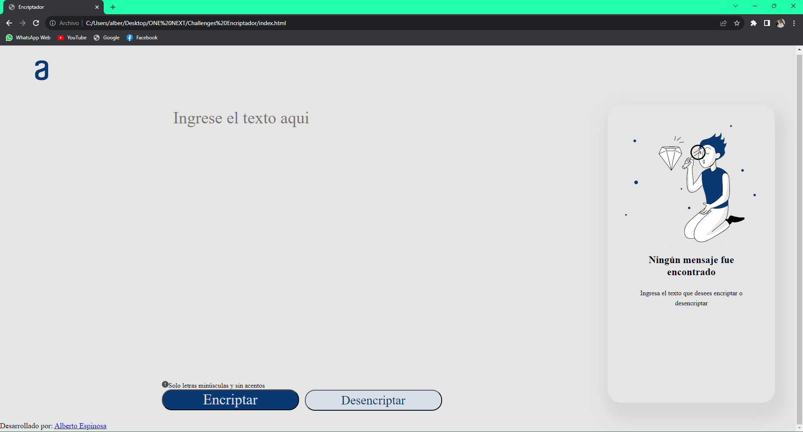
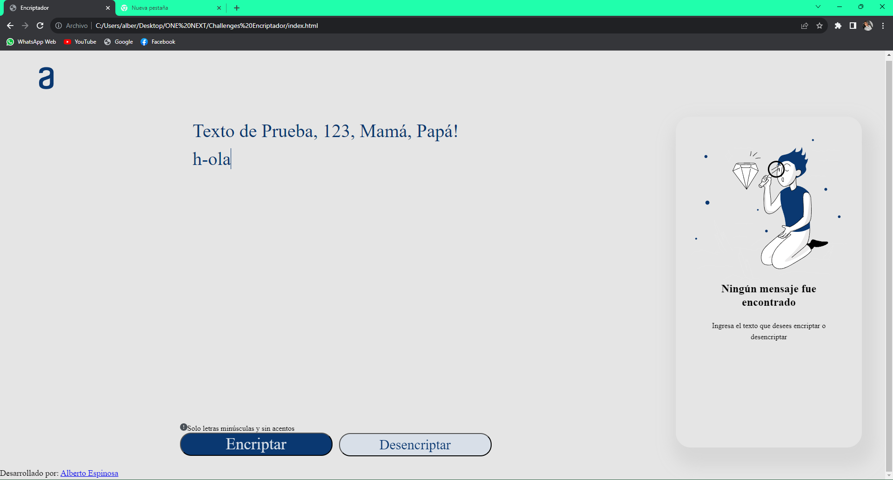
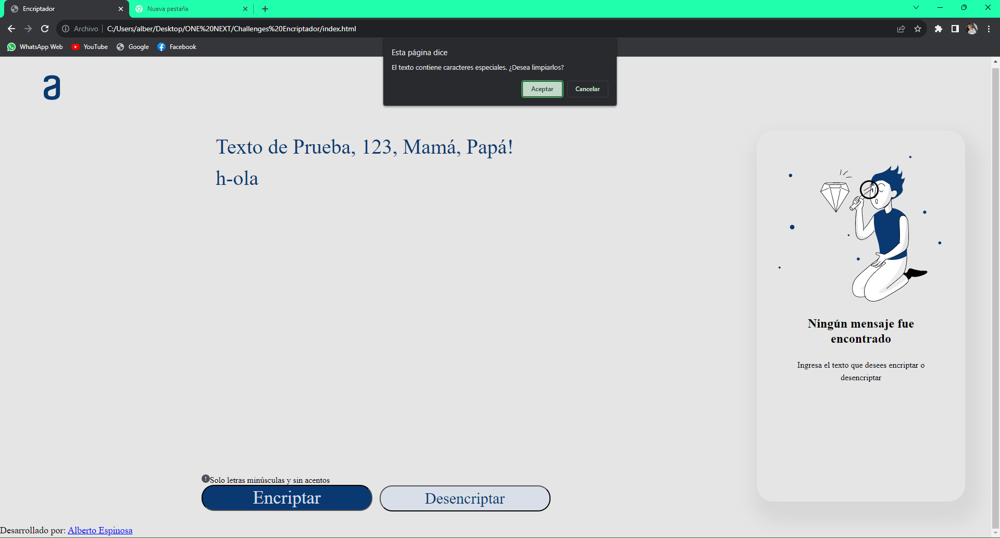
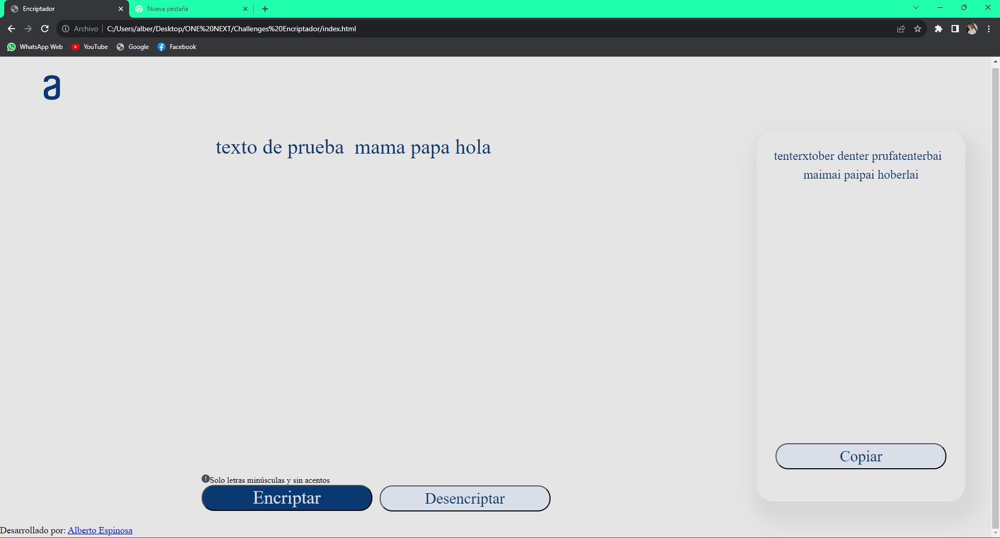

<h1>Encriptador de Texto</h1>

<h2>Descripción</h2>

Challenge ONE Sprint 01: Construye un encriptador de texto con Javascript, este desafio por parte del curso Oracle ONE, donde se mostraran las habilidades en HTML, JS, CSS

<h2>Encriptacion del texto</h2>

Las "llaves" de encriptación que utilizaremos son las siguientes: 

<ul>
  <li>La letra "e" es convertida para "enter"</li>
  <li>La letra "i" es convertida para "imes"</li>
  <li>La letra "a" es convertida para "ai"</li>
  <li>La letra "o" es convertida para "ober"</li>
  <li>La letra "u" es convertida para "ufat"</li>
</ul>

Tambien el texto ingresado debera cumplir con lo siguiente

<ul>
  <li>Debe funcionar solo con letras minúsculas</li>
  <li>No deben ser utilizados letras con acentos ni caracteres especiales</li>
  <li>Debe ser posible convertir una palabra para la versión encriptada también devolver una palabra encriptada para su versión original.</li>
</ul>

<h2>Muestras de funcionamiento</h2>

